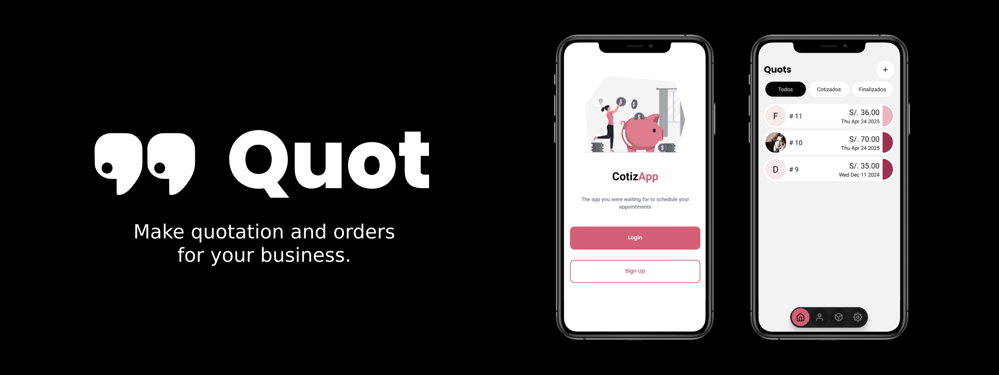

# 📄 QUOT: Streamline Your Business Quotes & Orders!

QUOT is a powerful mobile app designed to simplify quotes, orders, and invoicing for businesses. Effortlessly manage clients and products in one place. Convert quotes to orders with a tap, generate invoices, and sync data locally or to Google Drive for secure access anywhere.

### ✨ Features
- Client & Product Management: Add/edit clients and products.
- Quote-to-Order Workflow: Create quotes, approve them as orders, and generate invoices.
- Cloud + Local Sync: Data stored in SQLite (offline) with optional backup to Google Drive.
- Invoice Generation: Automatically create invoices with order details.
- Real-Time Updates: Track quote/order statuses (Pending, Approved, Completed).

### 🚀 Built With

- React Native & Expo: Cross-platform compatibility and rapid development.
- Tailwind CSS: Stylish, consistent UI with utility-first styling.
- Zustand: Lightweight state management for smooth data flow.
- SQLite: Local database for offline access and performance.
- Google Drive API: Secure cloud backups and synchronization.

### 🎯 Use Cases
- Small Businesses: Manage sales pipelines without complex software.
- Field Sales Teams: Create quotes on-the-go, even offline.
- Retail/Service Providers: Track orders from request to fulfillment.

### 💬 Feedback
We'd love to hear your thoughts! Feel free to contact me for more information.

      
